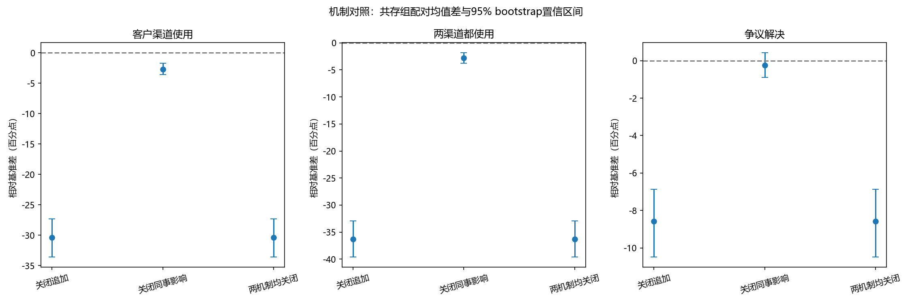
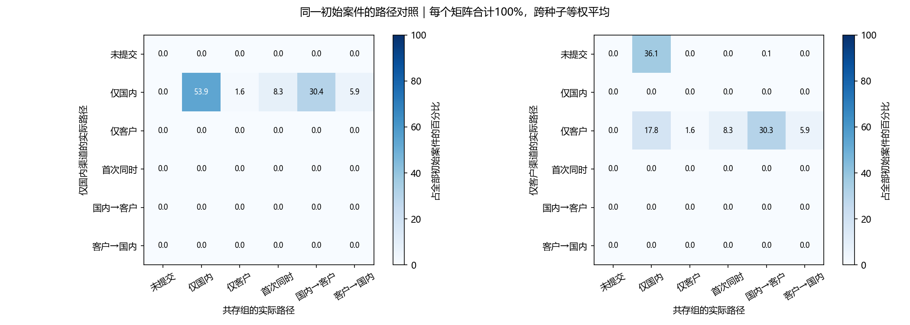
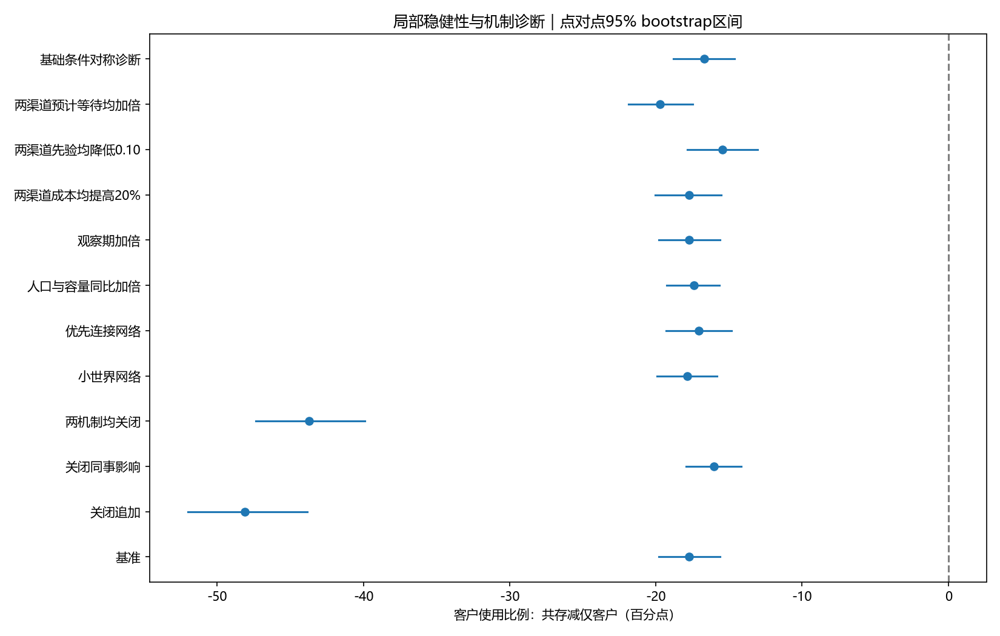

# 国内正式渠道与外部商业客户渠道的竞争：首次选择与后续追加的多主体仿真

版本：中文工作初稿（历史版本），2026-09-17。供与导师讨论；不是投稿定稿。本文数字取自已归档的早期机制检查实验，不能作为当前主线的最新结果。当前实验入口和结果以项目根目录 README 及 `IMAGE_RESEARCH_MAINLINE.md` 为准。

## 摘要

国内正式争议处理渠道与外部商业客户渠道同时存在时，员工对渠道的使用可能同时表现为首次替代与后续追加。为分析这种动态关系，本文构建案件级多主体模型，分别记录员工首次选择、等待后的双向追加以及争议解决，并区分国内机构处理与结果落实、客户审核与企业商业响应。实验在固定渠道条件下比较仅国内、仅客户和双渠道共存，采用配对随机设计开展720次仿真，并设置追加、同事影响的机制对照及对称诊断。在所设参数下，共存组禁止后续追加后，客户渠道使用比例下降30.38个百分点，案件解决比例下降8.58个百分点；关闭同事影响后的变化较小。对称诊断未提供足够证据认定存在明显的单渠道偏向。解析检查同时发现，默认效用范围使全部初始争议在首轮提交，因此该设定不能用于解释首次投诉的网络扩散。研究提供了分析首次选择与后续追加的可复现框架，同时界定参数驱动结果与可检验机制之间的区别。结论限于模型内部，尚未经现实校准。

关键词：多主体仿真；渠道竞争；劳动争议；顺序选择；后续追加；机制检验

## 1 引言

劳动争议可能涉及多种受理和补救途径。本文关注国内正式渠道与通过雇主商业客户产生影响的外部渠道。外部商业客户不是外国监管机构，也不必然位于境外。企业内部联系、人力资源部门与国内正式争议处理机构应予区分。

公共与私人治理关系已有经验研究。例如Amengual讨论了多米尼加的公共与私人劳动治理互补[1]；Harrison等研究了私人劳动投诉机制的实际表现[2]。这些工作说明本研究不能将两类渠道的并存本身当作发现。本文将问题限定为固定制度规则下的员工渠道使用竞争，不模拟机构主动调整政策的策略博弈。

只观察最终渠道使用比例，无法区分员工最初改选另一渠道、同时使用、后续追加或提前解决后不再行动。因此，本文在同一案件上记录完整路径，并比较渠道单独存在与共同存在时的变化。研究问题为：RQ1，另一条渠道的存在如何改变首次选择与累计使用？RQ2，允许后续追加相对于仅一次选择，会如何改变使用与解决结果？RQ3，当前这些变化在关闭同事影响与对称诊断中如何表现？RQ3是模型诊断，不构成额外政策主题。

本工作的可核实内容是案件级实现、配对反事实对照和机制诊断；尚不能声称提出全新的渠道选择理论或算法。

## 2 相关研究与建模依据

公共与私人劳动治理的关系不必仅表现为替代，相关经验分析已讨论不同治理工具的共同作用[1]。私人投诉机制研究也提示，进入机制、处理过程与获得补救应区别分析[2]。本文据此明确过程边界，但没有将这些研究的结果直接当成参数估计。

多渠道ABM已有零售领域先例。Sonderegger-Wakolbinger与Stummer将异质个体和社会互动用于渠道选择研究[3]。本次仅取得其出版社摘要，尚未完成全文规则对比，因此不能据此宣称本模型在方法上超越该工作。私人申诉渠道的可达性也已有研究[4]；其行业和机构类型与本文不同。

模型说明参考ODD所倡导的清晰、可复现描述原则[5]。局部参数扰动不等于完整敏感性分析[6]；实现测试也不能替代模型对现实研究目的的有效性验证[7]。各文献的访问程度、可用链接与尚未取得的全文列在 `LITERATURE_REVIEW.md`。

## 3 模型

### 3.1 主体、状态与边界

员工为决策主体，均匀平衡归属于若干企业，并通过无向网络联系。企业、国内机构与客户渠道在当前版本中表现为固定规则的处理过程，不包含独立的自适应策略。基准网络为ER图，期望度为6；网络结构不等同于企业归属，允许跨企业联系。

每个员工最多持有一个初始争议。案件有唯一编号，案件状态分为未提交、处理中、路径结束但未解决和已解决。国内/客户路径分别记录未使用、已提交、后续处理中、成功、结束未解决或因另一渠道解决而取消。国内另有“支持结果已形成、等待落实”状态。

只有未解决案件能够决策。同一案件每条渠道至多提交一次，解决后停止行动；两路径同轮成功仅记一个解决案件和一次标准化补救。标准化补救值是模型记账单位，不代表实际赔偿金额。本轮关闭新增争议、材料帮助、预防及公告模块；时间单位为抽象轮次，不解释为天或月。

### 3.2 主观判断与社会观察

令员工i对渠道k的基准主观成功判断为p⁰ᵢₖ，与客观处理概率分开抽样和配置。员工观察邻居当前在办及最近窗口内的投诉行动；窗口长度为3。近期结束的成功和未解决路径分别计入结果观察，尚在等待和取消不记失败。

若观察到的去重成功、失败邻居数为Sᵢₖ、Fᵢₖ，则当前判断为：

\[
\widehat p_{ik}=(1-\eta)p^0_{ik}+\eta\frac{\alpha p^0_{ik}+S_{ik}}{\alpha+S_{ik}+F_{ik}}.
\]

基准η=0.3、α=2。每轮从固定先验和当前窗口重新计算，避免把同一经历逐轮累加。它是探索性加权规则，不是经估计的贝叶斯学习。观察行动比例aᵢₖ的分母为全部邻居，孤立节点取0。新增渠道成本为cᵢₖ(1−w aᵢₖ)，w=0.2。

### 3.3 首次选择与后续追加

令A为本轮新增渠道集合，P为已提交且仍在处理的渠道集合。候选方案包括等待、单个可用未使用渠道，以及首次同时使用两者。已使用但失败的渠道不能再次提交；原有已付成本视为沉没成本。

对新渠道，主观成功机会按预计等待Tₖ折现为qᵢₖ= p̂ᵢₖ exp(−δTₖ)。对在办渠道，a为自提交以来的轮数：

\[
q_{ik}(a)=\widehat p_{ik}\exp[-\lambda\max(0,a-T_k)]\exp[-\delta\max(1,T_k-a)].
\]

基准δ=0.035、λ=0.12，T_D=T_E=3。默认主观双渠道联合成功按独立机会计算：G(Q)=1−∏ₖ∈Q(1−qᵢₖ)，空集合取0。代码另有成功重叠系数，但本轮主实验固定为0。

\[
U_i(A)=B_iG(P\cup A)-\sum_{k\in A}c_{ik}(1-wa_{ik})-c_m\mathbf1\{A\text{使案件成为双渠道案件}\}.
\]

员工选择效用最大的方案，B=1、额外协调成本c_m=0.02。效用完全相同时依候选顺序“不追加、国内、客户、同时”取首项。基准在首次提交满3轮后，每轮可重新评估是否追加。这里的规则不证明现实员工精确计算这些数值。

### 3.4 两渠道的客观流程

国内路径：提交后至少等待2轮，每轮最多处理12案；支持补救的概率为0.55(0.5+0.5mᵢ)，mᵢ均匀分布于[0.2,1]。获得支持后至少等待1轮进入独立落实过程，每轮容量12，条件落实成功概率0.85。支持结果或材料形成不等于案件解决；失败路径不重新处理。

客户路径：只有对应企业存在可用客户且员工可触达时才可提交。基准企业可用客户概率0.8、员工条件可达概率0.9。审核至少等待2轮，每轮容量12；介入概率为clip(0.2+0.45mᵢ,0,1)。介入后企业至少等待1轮，每家企业每轮最多处理3案，成功概率为clip(0.2+0.65d_f,0,1)。d_f是模型中的客户依赖变量，不直接等于海外收入占比。

国内与客户后续处理分别评价，再统一结案；另一未完成路径随案件解决而取消。固定容量队列按到期/提交时间及员工编号排序。国内失败不等于法律上认定员工没有权利，客户介入不等于法律裁决。

### 3.5 每轮顺序

初始争议生成后，每轮先冻结此前可见行动和结果，员工据此选择；然后处理国内机构队列与客户审核；再分别处理国内落实、客户后的企业响应；最后统一结案并记录统计。同轮刚形成的结果下轮才可观察。停止条件为固定观察期限，不以画出平台作为提前终止条件。

## 4 实验设计与指标

基准120名员工、6家企业、45轮，初始争议概率0.65。设置仅国内、仅客户、共存三组。组内只改变可用渠道集合，保持人口、网络、成本、主观判断和潜在事件随机数配对。

在此基础上设置12个实验块：基准、关闭追加、关闭同事影响、两机制均关闭、WS网络、BA网络、人口与容量同比加倍、观察期加倍、两渠道成本均提高20%、两渠道先验均降低0.10、预计等待均加倍、基础条件对称。每块三组、每组20个连续种子，总计720次；小规模流程检查72次不混入统计。所有条件为探索性设定，不是政策干预预测。

首次仅国内、首次仅客户、首次同时和未提交为互斥分类；后续单独记录D→E与E→D。累计渠道使用比例允许重叠，分母为全部初始争议案件。还报告解决率、未解决率、成功案件处理时间和累计未解决案件轮数。追加的条件比例以首次单渠道案件为分母，包含已提前解决者，不解释为仍在办者的风险率。

配对差先在每个随机种子内计算，再跨种子平均。以20个独立种子为重采样单位，bootstrap 2000次，报告百分位95%置信区间。该区间仅描述模拟随机性，未含现实参数不确定性，且未作多重比较调整。

同一个案按案件号、员工、企业和产生轮次匹配。使用变化拆分为新增使用和不再使用；后一类按是否被另一渠道解决进一步描述。该拆分是记账和路径分析，不是因果中介效应识别。

## 5 结果

### 5.1 共存中的使用变化

基准共存组国内使用为98.45%，客户使用为46.11%，两者都使用为44.55%，解决率46.60%。国内使用相对仅国内减少1.55个百分点；客户使用相对仅客户减少17.74个百分点，后者95%区间为[−19.82,−15.62]个百分点。共存相对仅国内的解决率增加8.18个百分点，区间[5.42,10.85]。

这些结果描述了固定条件下可用集合变化，不证明某种制度天然优越。客户可达性、成本和预期的不对称均是输入假设。使用下降也包括另一渠道提前解决的路径，不能全称为直接争夺。

### 5.2 后续追加与同事影响

|共存组|客户使用|两渠道都用|解决率|D→E占全部案件|E→D占全部案件|
|---|---:|---:|---:|---:|---:|
|基准|46.11%|44.55%|46.60%|30.38%|5.88%|
|关闭追加|15.73%|8.29%|38.01%|0.00%|0.00%|
|关闭同事影响|43.42%|41.73%|46.35%|27.69%|5.74%|
|两机制均关闭|15.73%|8.29%|38.01%|0.00%|0.00%|

关闭追加时，客户使用差为−30.38个百分点，区间[−33.58,−27.34]；解决率差为−8.58个百分点，区间[−10.49,−6.87]。关闭同事影响时，客户使用差为−2.69个百分点，区间[−3.60,−1.75]；解决率差为−0.25个百分点，区间[−0.90,0.42]。后者不足以支持明显的总解决率变化，也不证明影响严格为零。

### 5.3 使用减少的案件路径

在同一批配对案件中，占全部案件17.81%的个案在仅客户情景会使用客户，但共存时没有使用。其中14.82个百分点在共存情景已由国内解决，2.99个百分点仍未解决。另有0.07个百分点从仅客户情景未使用转为共存时使用。因此净变化约为−17.74个百分点。

观察到另一渠道解决，不足以证明其是未追加的唯一原因。该结果用于说明仅看总量会混合不同路径，未把差异分摊成“竞争贡献”和“互补贡献”。

### 5.4 默认设定的边界诊断

基准最低国内主观成功概率为0.35，最高成本为0.27，故初始国内效用下界为0.35 exp(−0.035×3)−0.27≈0.0451>0。仅国内时，所有初始争议都会提交。实际核对20种子共存组1557个案件，首次提交全部在第0轮。这个饱和现象可由参数解析推出，不是现实行为发现；同事影响在此基准下只能作用于后续追加。

对称诊断将两渠道可达性、成本/先验分布、阶段概率和等待匹配，排除容量限制并关闭社会影响。累计国内与客户使用分别为80.69%和79.20%，差1.49个百分点的区间为[−1.34,4.44]；不能断言存在显著系统性偏向。逐人交换成本和预期的2400次镜像检查无不一致；精确平局仍优先国内，须单独披露。

### 5.5 局部稳健性

本轮12块内的“共存减仅客户”客户使用差均为负，各逐项区间未跨零。对称诊断及机制关闭属于诊断块，不能与参数扰动一并宣传为全局稳健性证明。观察期限由45延至90轮，20种子共存组最终两渠道使用和解决比例均保持相同，表明这些终点指标在本次检查中未受到45轮截尾影响，但不证明长期均衡。

## 6 讨论

只允许首次选择会遗漏相当部分的客户渠道使用，并改变案件解决结果。这表明在本模型的研究目的下，将使用分为首次和追加有解释价值。然而，允许追加本就增加尝试机会；“追加更多”是规则直接允许的结果，不能单独作为创新。需要重点讨论其与解决、方向不对称及渠道覆盖变化的联系。

当前社会网络对后续使用有一定影响，但对总解决率的变化较小。基准全部首次行动发生于第0轮，使模型无法检验首次扩散。这一结果限制了复杂网络在论文中的角色：网络可作为信息环境，而不能未经证据升格为研究核心。

私人治理的经验研究仅为过程划分提供参考。本文不代表FLA、某家客户或某个国家实际制度；公共/私人渠道名称不是行为参数校准。现实中代表组织、处理权限及案件可并用范围尚待研究。本项目未据有限仿真对政治信任、权威或制度优劣作推断。

## 7 限制与后续验证

本模型未进行现实校准；成本、主观成功率及一次提交规则均为简化；固定初始队列和终止状态限制长期演化；国内为聚合正式流程，未区分具体法律程序；客户一侧也未模拟多个买方网络。观察到有限期使用替代不等于识别制度互补或战略竞争。

代码已有81项测试与案例守恒检查，属于实现核验；2400次镜像检查和局部扰动支持部分内部诊断，但均不能替代现实有效性[7]。全球文献新颖性、行为规则外部依据、局部参数以外的稳健性，仍是投稿前需要解决的问题。

下一轮不应为改变饱和曲线而任意调参，应首先明确研究是否只针对已经决定维权的初始案件群体；若仍要解释等待后首次行动，需要相应行为证据支持新的初始条件或决策机会设定。

## 8 结论

在本轮固定渠道规则下，首次选择和后续追加构成不同的竞争过程。后续追加的关闭明显改变客户使用和解决比例；同事影响的作用较小，并受初始首轮行动饱和限制。案件级配对分析能够呈现使用下降背后的不同路径，但尚不足以完成现实因果解释。本研究应定位为透明、可复现的探索性计算研究，后续以文献和外部证据审查行为假设。

## 数据与代码说明

核心规则仍可在 `src/channel_choice.py` 中查看；本文所引用的机制检查脚本和结果属于历史归档。当前新增的替代/互补、依赖差距及持续竞争实验请分别查看项目根目录的对应说明和输出目录。本稿未自动改写为最新投稿版本。

## 参考文献

1. Amengual, M. (2010). Complementary Labor Regulation: The Uncoordinated Combination of State and Private Regulators in the Dominican Republic. *World Development*, 38(3), 405–414. [DOI](https://doi.org/10.1016/j.worlddev.2009.09.007).
2. Harrison, J., Parejo, M., & Wielga, M. (2024). The value of complaints mechanisms in the private labour regulation of GVCs: A case study of the Fair Labor Association. *International Labour Review*, 163(1), 73–94. [开放全文入口](https://wrap.warwick.ac.uk/id/eprint/176853/).
3. Sonderegger-Wakolbinger, L., & Stummer, C. (2015). An agent-based simulation of customer multi-channel choice behavior. *Central European Journal of Operations Research*, 23, 459–477. [摘要](https://link.springer.com/article/10.1007/s10100-015-0388-5).
4. Babineau, K., & Stephens, M. (2024). Hotlines, Private Regulation, and Farm Migrant Labor Rights: Effective Grievance Mechanisms and the Role of Accessibility. *Geography Research Forum*, 43, 53–80. [期刊入口](https://grf.bgu.ac.il/index.php/GRF/article/view/631)。本次仅核查索引摘要和题录。
5. Grimm, V., et al. (2020). The ODD Protocol for Describing Agent-Based and Other Simulation Models: A Second Update to Improve Clarity, Replication, and Structural Realism. *JASSS*, 23(2), 7. [全文](https://www.jasss.org/23/2/7.html).
6. ten Broeke, G., van Voorn, G., & Ligtenberg, A. (2016). Which Sensitivity Analysis Method Should I Use for My Agent-Based Model? *JASSS*, 19(1), 5. [全文](https://www.jasss.org/19/1/5.html).
7. Collins, A., Koehler, M., & Lynch, C. (2024). Methods That Support the Validation of Agent-Based Models: An Overview and Discussion. *JASSS*, 27(1), 11. [全文](https://www.jasss.org/27/1/11.html).
